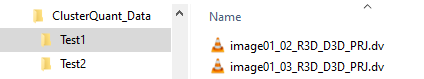
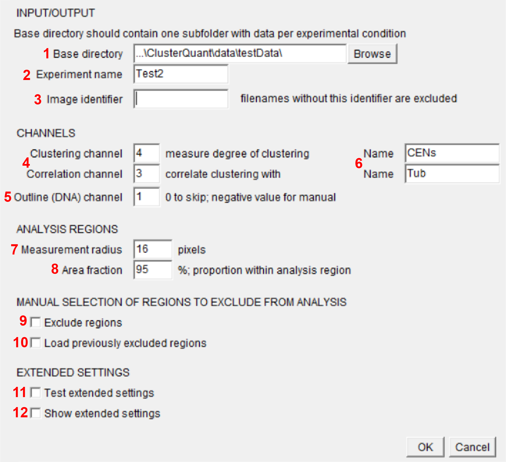

# README UNDER CONSTRUCTION

# ClusterQuant

## Introduction

This project measures the degree of clustering of individual spots relative to local signal intensity of another channel.
_explanation of whay macro does specifically (use images to explain): recognize spots - put circles around - count other spots within circle - measure signal intensity in circle_

&nbsp;
&nbsp;

## Running the code
1) Organize image data as explained below
2) Run _Cluster_Quant.ijm_ and select base data folder
3) Run _Analyze_ClusterQuant.py_ on the csv output file from step 2 (filename starting with _\_PythonInput_)

#### Step 1: Input data organization
Macro works on any projected microscopy image that can be opened in FiJi.
Create a base directory for data analysis. 
Within the base directory, create separate directories for each condition to be analyzed. The names of these folders will be used as indentifier in data output, so ideally give them brief names clearly indicating the condition used. Note that any folder starting with an underscore will be skipped during analysis.
Within these directories, place all images to be analyzed for this condition.  
E.g.,  
&nbsp; &nbsp; &nbsp; &nbsp; 

#### Step 2: Running ClusterQuant.ijm from FiJi (ImageJ)
Drag _Cluster_Quant.ijm_ into FiJi and hit Run at the bottom of the script editor. This will open a dialog window with a number of options.

1) Choose base directory as explained above
2) Name for the output folder
3) Identification text that must be present in all filenames to be read; any filename that does not contain. E.g. if folders contain both raw data and projected images, write the identifying part of the filename of the projected images (usually "PRJ"). This can be left empty if all files present in the folders should be analyzed.
4) Channels to measure clustering (a) and cross-correlation signal (b) in.
5) Channel to use to determine the region within which clustering should be measured. Set to 0 to include full image
6) Name of the channels used in data output graphs and sheets
7) Radius (in pixels) of circle around each spot
8) Fraction of circle that must be part of analysis region (determined by outline channel/manually excluded regions)
9) Turn on to pause macro at each image and mannually select regions to exclude from analysis
10) Turn on to load previously excluded regions from analysis (ignores setting above). If this is turned on, an additional dialog window will open where an ROI folder created during a previous run can be selected.
11) Turn on to run in test mode. The macro will stop a few times during each image to allow for manual tuning of settings. Cancel the test run and use optimal settings in extended settings
12) Turn on to change extended settings in additional dialog  

&nbsp; &nbsp; &nbsp; &nbsp; 

#### Step 3: Running Analyze_ClusterQuant.py in Python

At the end of step 2 a csv file is created, which forms the input data for the python code. This file is named _\_PythonInput\_[datetime]\_Radius[XX].csv_.  
Open _Analyze_ClusterQuant.py_ in a python console (Anaconda Spyder works well).  
Run the code (F5 in Spyder) and choose the newly created PythonInput file mentioned above.
See below for some optional data output types

## Data output
_add DEFAULTS OUTPUTS_
_add EXAMPLE IMAGES OF WHAT OUPUT LOOKS LIKE_

At the top of the code a few optional output types that can be turned on or off in addition to the standard ones.
- makeLineplot: An XY graph is created, which shows the correlation between spot number of intensity of secondary signal (single graph with one line per condition).
- makeViolinplots (slow for large datasets): Violinplots are created showing the correlation for individual images (one graph per input image). This is slow for large datasets.
- spotBasedPrism (VERY slow for large datasets): Additional files to create scatterplots for Prism with one point per spot for every spot of every image in the dataset

_add EXAMPLE IMAGES OF THESE AS WELL_

## License

This project is licensed under the terms of the [MIT License](/LICENSE.md)

## Citation

Please [cite this project as described here](/CITATION.md).
